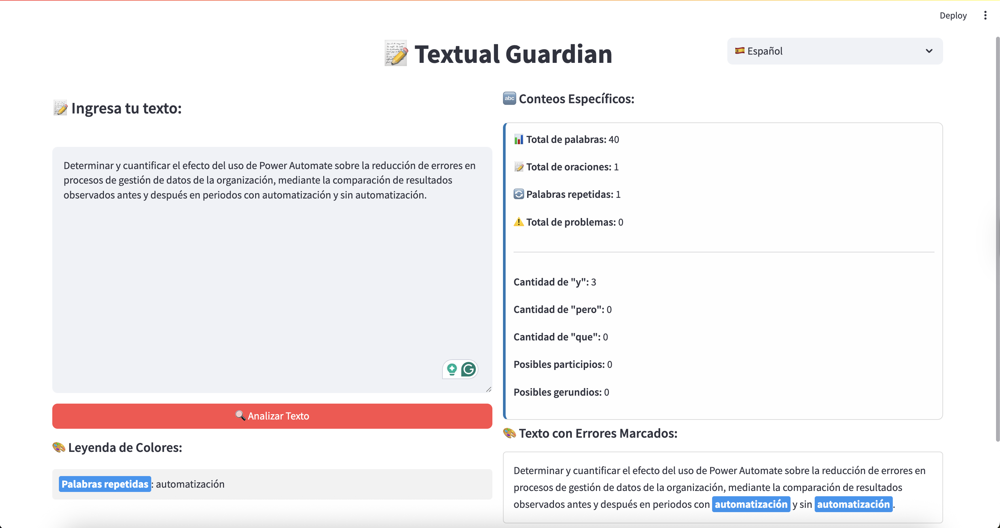

# 📝 Textual Guardian

Analizador de redacción académica desarrollado en Python con Streamlit que detecta problemas comunes en textos académicos.

## ✨ Características

- 🔄 **Detección de palabras repetidas** - Identifica términos que se repiten excesivamente
- 📋 **Detección de participios** - Encuentra palabras terminadas en -ado, -ido  
- 🔄 **Detección de gerundios** - Localiza palabras terminadas en -ando, -endo
- ⚠️ **Expresiones problemáticas** - Detecta frases como "ya que", "etc.", "pero"
- 🏷️ **Adjetivos calificativos** - Identifica adjetivos vagos como "grande", "pequeño"
- ✏️ **Puntuación incorrecta** - Encuentra comas antes del conectivo "y"
- 📊 **Estadísticas del texto** - Conteo de palabras y resumen de problemas
- 🌐 **Interfaz bilingüe** - Soporte completo para español e inglés
- ⚡ **Análisis en tiempo real** - Resultados instantáneos mientras escribes
- 🎨 **Marcado visual** - Errores resaltados con diferentes colores

## 🚀 Instalación y Uso

### Requisitos previos
- Python 3.7 o superior
- pip (gestor de paquetes de Python)

### Instalación

1. Clona este repositorio:
```bash
git clone <repository-url>
cd textual-guardian
```

2. Instala las dependencias:
```bash
pip install -r requirements.txt
```

### Ejecución

Ejecuta la aplicación con:
```bash
streamlit run streamlit_app.py
```

La aplicación se abrirá automáticamente en tu navegador en `http://localhost:8501`

## 🐳 Uso con Podman

### Requisitos previos para Podman
- Podman instalado en tu sistema
- podman-compose (opcional, para usar docker-compose.yml)

### Opción 1: Scripts simplificados (Más fácil) ⚡

Para máxima simplicidad, usa los scripts incluidos:

```bash
# Reinicio completo: detener, eliminar, construir y ejecutar
./start.sh

# Detener y limpiar todo
./stop.sh
```

El script `./start.sh` realizará automáticamente todo el proceso:


*El script detiene cualquier contenedor existente, construye la imagen y ejecuta el nuevo contenedor automáticamente.*

### Opción 2: Usando Makefile

El proyecto incluye un `Makefile` para facilitar el uso con Podman:

```bash
# Ver todos los comandos disponibles
make help

# Reinicio completo (usa start.sh)
make quick-start

# Detener completamente (usa stop.sh)
make quick-stop

# Comandos individuales:
make build     # Construir la imagen
make run       # Ejecutar el contenedor
make logs      # Ver logs
make clean     # Detener y limpiar
```

### Opción 3: Usando podman-compose

```bash
# Levantar la aplicación
podman-compose up -d

# Ver logs
podman-compose logs -f

# Detener la aplicación
podman-compose down
```

### Opción 4: Comandos manuales de Podman

```bash
# Construir la imagen
podman build -t textual-guardian .

# Ejecutar el contenedor
podman run -d --name textual-guardian-app -p 8501:8501 textual-guardian

# Ver logs
podman logs -f textual-guardian-app

# Detener el contenedor
podman stop textual-guardian-app

# Eliminar el contenedor
podman rm textual-guardian-app
```


### Modo Desarrollo

Para desarrollo con recarga automática:

```bash
# Usando Makefile
make dev

# O manualmente
podman run -d --name textual-guardian-dev -p 8501:8501 -v ./:/app:Z textual-guardian
```

**Acceso:** La aplicación estará disponible en `http://localhost:8501`

## 📖 Cómo usar

1. Abre la aplicación en tu navegador
2. Escribe o pega tu texto en el área de texto de la izquierda
3. El análisis se actualiza **automáticamente en tiempo real**
4. Revisa los resultados en la columna derecha:
   - **Leyenda de Colores:** Muestra las palabras problemáticas encontradas
   - **Conteos Específicos:** Estadísticas detalladas del texto
   - **Texto Marcado:** Tu texto con errores resaltados en colores

### 🖼️ Interfaz de la Aplicación

#### 🇪🇸 Interfaz en Español


#### 🇺🇸 English Interface


*La aplicación cuenta con soporte bilingüe completo (español/inglés) para la interfaz de usuario. El análisis de texto se mantiene basado en reglas académicas en español independientemente del idioma de la interfaz. La interfaz muestra análisis en tiempo real con leyenda dinámica, conteos específicos y texto marcado con colores para diferentes tipos de errores.*

## 🎯 Reglas de Redacción Implementadas

La aplicación detecta problemas basados en las siguientes indicaciones académicas:

1. **Repetición de términos** - Sugiere usar sinónimos
2. **Participios** - Evitar terminaciones -ado, -ido
3. **Gerundios** - Eliminar terminaciones -ando, -endo
4. **Expresiones prohibidas**:
   - "ya que" → usar "debido a que", "dado que"
   - "etc." → usar "tales como", "entre otros"
   - "pero" → usar "sin embargo", "no obstante"
   - "puede/pueden" → usar "permite", "facilita"
   - "pretende" → usar "busca", "requiere"
5. **Adjetivos calificativos** - Evitar términos vagos
6. **Puntuación** - No usar coma antes de "y"

## 🛠️ Estructura del Proyecto

```
textual-guardian/
├── streamlit_app.py    # Aplicación principal de Streamlit
├── text_analyzer.py    # Módulo de análisis de texto
├── requirements.txt    # Dependencias de Python
├── Dockerfile          # Configuración de contenedor
├── docker-compose.yml  # Configuración para podman-compose
├── Makefile           # Comandos automatizados para Podman
├── start.sh           # Script de inicio simplificado
├── stop.sh            # Script de detención y limpieza
├── .dockerignore      # Archivos ignorados en la imagen
├── docs/              # Documentación y recursos
│   └── assets/        # Imágenes y recursos multimedia
│       ├── textual-guardian-spanish.png
│       └── textual-guardian-english.png
├── README.md          # Este archivo
└── LICENSE           # Licencia del proyecto
```

## 🤝 Contribuciones

Las contribuciones son bienvenidas. Por favor:

1. Fork el proyecto
2. Crea una rama para tu feature (`git checkout -b feature/AmazingFeature`)
3. Commit tus cambios (`git commit -m 'Add some AmazingFeature'`)
4. Push a la rama (`git push origin feature/AmazingFeature`)
5. Abre un Pull Request

## 📄 Licencia

Este proyecto está bajo la licencia especificada en el archivo `LICENSE`.
