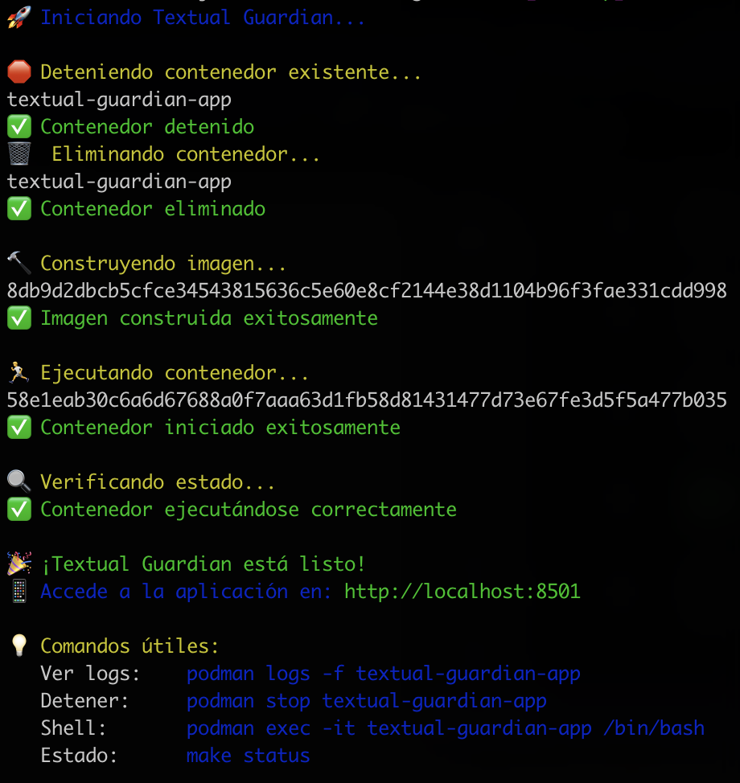

# 📝 Textual Guardian

Academic writing analyzer developed in Python with Streamlit that detects common problems in academic texts.

## ✨ Features

- 🔄 **Repeated word detection** - Identifies excessively repeated terms
- 📋 **Participle detection** - Finds words ending in -ado, -ido  
- 🔄 **Gerund detection** - Locates words ending in -ando, -endo
- ⚠️ **Problematic expressions** - Detects phrases like "ya que", "etc.", "pero"
- 🏷️ **Qualifying adjectives** - Identifies vague adjectives like "grande", "pequeño"
- ✏️ **Incorrect punctuation** - Finds commas before the connector "y"
- 📊 **Text statistics** - Word count and problem summary
- 🌐 **Bilingual interface** - Complete support for Spanish and English
- ⚡ **Real-time analysis** - Instant results while you type
- 🎨 **Visual marking** - Errors highlighted with different colors

## 🎯 Implemented Writing Rules

The application detects problems based on the following academic guidelines:

1. **Term repetition** - Suggests using synonyms
2. **Participles** - Avoid endings -ado, -ido
3. **Gerunds** - Eliminate endings -ando, -endo
4. **Prohibited expressions**:
   - "ya que" → use "debido a que", "dado que"
   - "etc." → use "tales como", "entre otros"
   - "pero" → use "sin embargo", "no obstante"
   - "puede/pueden" → use "permite", "facilita"
   - "pretende" → use "busca", "requiere"
5. **Qualifying adjectives** - Avoid vague terms
6. **Punctuation** - Do not use comma before "y"

## 🚀 Installation and Usage

### Prerequisites
- Python 3.7 or higher
- pip (Python package manager)

### Installation

1. Clone this repository:
```bash
git clone <repository-url>
cd textual-guardian
```

2. Install dependencies:
```bash
pip install -r requirements.txt
```

### Execution

Run the application with:
```bash
streamlit run streamlit_app.py
```

The application will automatically open in your browser at `http://localhost:8501`

## 🐳 Using with Podman

### Podman Prerequisites
- Podman installed on your system
- podman-compose (optional, to use docker-compose.yml)

### Option 1: Simplified Scripts (Easiest) ⚡

For maximum simplicity, use the included scripts:

```bash
# Complete restart: stop, remove, build and run
./start.sh

# Stop and clean everything
./stop.sh
```

The `./start.sh` script will automatically perform the entire process:



*The script stops any existing containers, builds the image and runs the new container automatically.*

### Option 2: Using Makefile

The project includes a `Makefile` to facilitate Podman usage:

```bash
# View all available commands
make help

# Complete restart (uses start.sh)
make quick-start

# Stop completely (uses stop.sh)
make quick-stop

# Individual commands:
make build     # Build the image
make run       # Run the container
make logs      # View logs
make clean     # Stop and clean
```

### Option 3: Using podman-compose

```bash
# Start the application
podman-compose up -d

# View logs
podman-compose logs -f

# Stop the application
podman-compose down
```

### Option 4: Manual Podman Commands

```bash
# Build the image
podman build -t textual-guardian .

# Run the container
podman run -d --name textual-guardian-app -p 8501:8501 textual-guardian

# View logs
podman logs -f textual-guardian-app

# Stop the container
podman stop textual-guardian-app

# Remove the container
podman rm textual-guardian-app
```


### Development Mode

For development with automatic reload:

```bash
# Using Makefile
make dev

# Or manually
podman run -d --name textual-guardian-dev -p 8501:8501 -v ./:/app:Z textual-guardian
```

**Access:** The application will be available at `http://localhost:8501`

## 📖 How to Use

1. Open the application in your browser
2. Write or paste your text in the left text area
3. The analysis updates **automatically in real time**
4. Review the results in the right column:
   - **Color Legend:** Shows the problematic words found
   - **Specific Counts:** Detailed text statistics
   - **Marked Text:** Your text with errors highlighted in colors

### 🖼️ Application Interface

#### 🇪🇸 Spanish Interface


#### 🇺🇸 English Interface


*The application features complete bilingual support (Spanish/English) for the user interface. Text analysis remains based on Spanish academic rules regardless of the interface language. The interface shows real-time analysis with dynamic legend, specific counts and text marked with colors for different types of errors.*

## 🛠️ Project Structure

```
textual-guardian/
├── streamlit_app.py    # Main Streamlit application
├── text_analyzer.py    # Text analysis module
├── requirements.txt    # Python dependencies
├── Dockerfile          # Container configuration
├── docker-compose.yml  # Configuration for podman-compose
├── Makefile           # Automated commands for Podman
├── start.sh           # Simplified startup script
├── stop.sh            # Stop and cleanup script
├── .dockerignore      # Files ignored in image
├── docs/              # Documentation and resources
│   └── assets/        # Images and multimedia resources
│       ├── script-start.png
│       ├── textual-guardian-spanish.png
│       └── textual-guardian-english.png
├── README.md          # This file
└── LICENSE           # Project license
```

## 🤝 Contributing

Contributions are welcome. Please:

1. Fork the project
2. Create a feature branch (`git checkout -b feature/AmazingFeature`)
3. Commit your changes (`git commit -m 'Add some AmazingFeature'`)
4. Push to the branch (`git push origin feature/AmazingFeature`)
5. Open a Pull Request

## 📄 License

This project is under the license specified in the `LICENSE` file.
